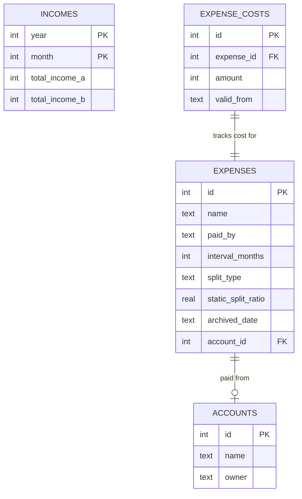

# Duomi 💸

Duomi is a sleek, premium, and feature-rich shared expense tracker designed for couples and cohabitants. It calculates fair, income-proportionate splitting of shared household bills while supporting static ratios, multi-month timelines, and interactive price histories.

The application features a modern, responsive user experience inspired by premium aesthetics (vibrant color accents, smooth transitions, custom scrollbars, and tactile inputs) built on top of **SvelteKit**, **Tailwind CSS**, and **SQLite (Drizzle ORM)**.

---

## Key Features

- 🔄 **Dynamic Split Ratio**: Dynamically calculates splitting percentages based on each person's monthly income.
- 🎯 **Static Overrides**: Custom discrete split slider (snaps to common ratios like 50/50, 60/40, or 1/3) for bills that aren't split by income.
- 📆 **Flexible Frequency**: Support for one-time, monthly, quarterly, and yearly expenses with reactively calculated next payment dates.
- 📈 **Price History & Archiving**: Tracks historical costs for every expense. Old prices are kept intact in the history when updating amounts. Templates can be archived rather than hard deleted.
- 🚪 **Sliding Fixed Sidebar**: Templates open in a sliding sidebar panel that covers the screen on mobile and slides smoothly from the right on desktop, with clicking outside triggering automatic saves.
- ⚡ **Tactile Inline Editing**: Change incomes and costs inline instantly on the dashboard. Edits auto-save when pressing **Enter** or on blur.
- 🇸🇪 **Swedish & English Localization**: Built-in translation engine supporting local currency formatting (`kr`) and language switching.
- 🤖 **Demo Mode**: When `DEMO_MODE=true` is set, the SQLite database is automatically seeded with several months of sample shared expenses and income history on startup.

---

## Technology Stack

- **Framework**: [SvelteKit](https://kit.svelte.dev/) (with Svelte 5 runes)
- **Styling**: [Tailwind CSS v4](https://tailwindcss.com/)
- **Database**: [SQLite](https://sqlite.org/) via [Better-SQLite3](https://github.com/WiseLibs/better-sqlite3)
- **ORM**: [Drizzle ORM](https://orm.drizzle.team/)
- **Icons & Fonts**: Google Fonts (Inter & Open Sans), Google Material Symbols

---

## Database Architecture

Duomi uses a lightweight SQLite database structure managed through Drizzle:



---

## Getting Started

### Prerequisites

- [Node.js](https://nodejs.org/) (v18 or higher recommended)
- `npm` or `pnpm`

### Installation

1. Clone the repository and navigate to the directory:
   ```sh
   git clone <repository-url>
   cd duomi
   ```

2. Install the dependencies:
   ```sh
   npm install
   ```

3. (Optional) Run database migrations/synchronization:
   ```sh
   npm run prepare
   ```

### Running Locally

To start the development server:

```sh
# Normal mode
npm run dev

# Demo Mode (seeds sample history)
DEMO_MODE=true npm run dev
```

Open [http://localhost:3001](http://localhost:3001) in your browser to view the application.

### Running Tests

To run the unit tests with Vitest:

```sh
npm test
```

### Building for Production

To compile the application:

```sh
npm run build
npm run preview
```

---

## UX Details & Guidelines

- **Aesthetics**: Custom-curated HSL palettes (`#ff7361` for Person A / Coral, `#4fd1c5` for Person B / Teal) paired with a clean off-white background (`#fbf9f5`).
- **Autosave**: Modifying slider splits, frequency intervals, text fields, or bank accounts automatically submits changes without requiring a generic "Save Changes" button.
- **Fallbacks**: When checking a month with empty/unconfigured incomes, Duomi locates the last known month with non-zero incomes and shows them as semi-opaque placeholders to guide the user.

---

*Made with 💖 for smooth shared living.*
