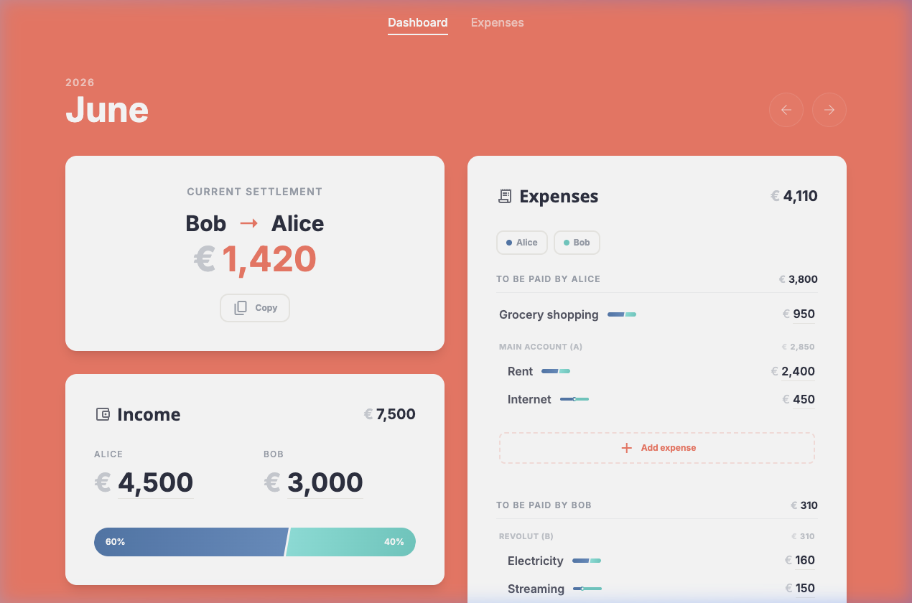

# Duomi 💸

[](https://duomi.onrender.com)
[](https://svelte.dev)
[](https://tailwindcss.com)
[](https://sqlite.org)
[](https://www.docker.com)

**Duomi** is an expense tracker designed to fulfill two goals:

- 🔮 **Predictable economy**: verify which expenses needs to be paid, what months are more expensive and how expenses change over time
- ⚖️ **Fair splitting**: expenses can be split based on income or by a custom ratio and then each month how much to settle is automatically calculated

Made specifically and enhanced for household setups of two persons contributing to shared costs, Duomi is a self-hostable app meant to run on your own server to keep your economy private. Use it in a browser (e.g. on a tablet) or as a PWA on mobile devices. Supports English and Swedish.

Designed with [Stitch](https://www.stitch.app/en/learn-stitch/ai-design-tools) and built with [Antigravity](https://antigravity.com/), the app features a modern, responsive user experience built on top of **SvelteKit**, **Tailwind CSS**, and **SQLite (Drizzle ORM)**.

### 🌐 Live Demo

You can try out Duomi at **[duomi.onrender.com](https://duomi.onrender.com)**.
*   **Passphrase**: `show me the money` (the demo has passphrase protection enabled)
*   **Demo Mode**: The live demo is seeded with several months of sample shared expenses and income history for testing.



## Key features

- 🔄 **Split expenses by income**: Dynamically calculates splitting percentages based on each person's monthly income.
- 🎯 **Custom splitting ratios**: Set expenses to be split 50/50 (or other ratios) for bills that should not be split based on income.
- 📆 **Flexible frequency**: Expenses will only show for relevant months, based on if they're set up as one-time, monthly, quarterly, or yearly.
- 📈 **Price history**: One click in dashboard to update an expense amount. Old amounts are saved to the expense's price history and can be tracked in a diagram.
- ⚡ **Tactile inline editing**: Change incomes and costs inline instantly on the dashboard. Edits auto-save when pressing **Enter** or clicking outside.
- 🇸🇪 **Swedish & English Localization**: Built-in translation engine supporting local currency formatting (`kr`) and language switching.
- 🤖 **Demo Mode**: Start the app with `DEMO_MODE=true` to seed the SQLite database with several months of sample shared expenses and income history.

## Tech stack

- **Framework**: [SvelteKit](https://kit.svelte.dev/) (with Svelte 5 runes)
- **Styling**: [Tailwind CSS v4](https://tailwindcss.com/)
- **Database**: [SQLite](https://sqlite.org/) via [Better-SQLite3](https://github.com/WiseLibs/better-sqlite3)
- **ORM**: [Drizzle ORM](https://orm.drizzle.team/)
- **Icons & Fonts**: Google Fonts (Inter & Open Sans), Google Material Symbols

## Getting started

### Docker

To run Duomi using **Docker Compose** with the prebuilt image published on GitHub Container Registry (GHCR):

1. **Configure `docker-compose.yml`**:
   Use the provided [docker-compose.yml](docker-compose.yml) file. You can customize the application's configuration by modifying its `environment` section as per the [configuration](#configuration) options below.

2. **Start the application**:

   ```sh
   docker compose up -d
   ```

3. **Access the application**:
   Open [http://localhost:3001](http://localhost:3001) in your browser.

4. **Stop the application**:
   ```sh
   docker compose down
   ```

### Node.js

To run Duomi locally with **Node.js** (recommended for development):

#### Prerequisites

- [Node.js](https://nodejs.org/) (v18 or higher recommended)
- `npm` or `pnpm`

#### Installation & setup

1. **Clone the repository**:

   ```sh
   git clone https://github.com/oscarb/duomi.git
   cd duomi
   ```

2. **Install dependencies**:

   ```sh
   npm install
   ```

3. **Configure environment variables**:
   Copy `.env.example` to `.env` and adjust the variables to your setup (see the [Configuration](#configuration) section for details):

   ```sh
   cp .env.example .env
   ```

4. **Synchronize SvelteKit files**:
   ```sh
   npm run prepare
   ```

#### Running locally

To start the development server:

```sh
# Normal mode
npm run dev

# Demo Mode (seeds sample history)
DEMO_MODE=true npm run dev
```

Open [http://localhost:3001](http://localhost:3001) in your browser to view the application.

#### Running tests

To run the unit tests with Vitest:

```sh
npm test
```

#### Building for production

To compile and preview the production bundle locally:

```sh
npm run build
npm run preview
```

## Configuration

Duomi can be configured using environment variables. These can be defined in your `.env` file (for local Node.js setups) or directly inside the `environment` section of `docker-compose.yml` (for Docker setups).

| Variable                | Description                                                                  | Default / Example |
| ----------------------- | ---------------------------------------------------------------------------- | ----------------- |
| `DATABASE_URL`          | File path to the SQLite database file.                                       | `./data/duomi.db` |
| `DEMO_MODE`             | If `true` and the database is empty, seeds mock incomes/expenses on startup. | `false`           |
| `PUBLIC_PERSON_A_NAME`  | Display name for Person A.                                                   | `Partner A`       |
| `PUBLIC_PERSON_B_NAME`  | Display name for Person B.                                                   | `Partner B`       |
| `LOCALE`                | UI language and locale formatting (e.g., `en-US`, `sv-SE`).                  | `en-US`           |
| `CURRENCY`              | Currency format code or symbol (e.g., `USD`, `SEK`).                         | `USD`             |
| `SECRET_APP_PASSPHRASE` | Set a passphrase to restrict access. Leave empty to disable authentication.  | (None)            |
| `ORIGIN`                | The external origin of the application. Required when running behind a reverse proxy (e.g., on a NAS) to prevent SvelteKit's CSRF protection from blocking form submissions. | (None) / `https://duomi.yourdomain.com` |

---

_Made with 💖 for smooth shared living._
